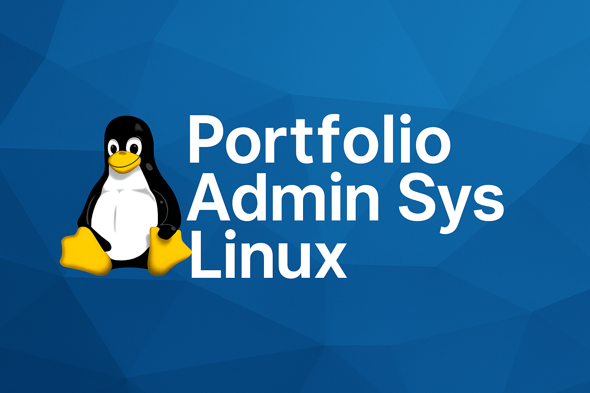

  

# 🐧 Portfolio – Administration Système Linux

Bienvenue sur mon portfolio de projets d’administration système Linux.  
Ce dépôt regroupe l’ensemble de mes travaux pratiques, classés du niveau débutant à avancé, réalisés dans le cadre de ma montée en compétences vers le métier d’**Administrateur Système Linux / DevOps**.

---

## 🎯 Objectif du projet
> **Construire une expérience technique concrète** à travers des projets réels et documentés, du simple serveur web à l’infrastructure virtualisée complète avec conteneurs et automatisation.

Chaque projet est conçu pour :
- Mettre en pratique les notions clés de l’administration Linux.
- Comprendre la logique des services et de la sécurité.
- Produire une documentation claire et réutilisable.
- Servir de support lors d’entretiens techniques.

---

## 🧭 Plan de progression

| Niveau | Domaine | Projet | État |
|:-------|:---------|:--------|:------|
| 🟢 Débutant | Web | [Serveur Apache](./projets/serveur-web-apache) | ✅ Terminé |
| 🟢 Débutant | Web | [Serveur Nginx & Reverse Proxy](./projets/serveur-web-nginx) | 🔜 En cours |
| 🟠 Intermédiaire | Réseau | Serveur DNS & DHCP | ⏳ À venir |
| 🟠 Intermédiaire | Supervision | Zabbix / Grafana | ⏳ À venir |
| 🔵 Avancé | Virtualisation | Infrastructure VMware / Proxmox | ⏳ À venir |
| 🔵 Avancé | Conteneurisation | Docker & Kubernetes | ⏳ À venir |
| 🔵 Avancé | Automatisation | Ansible / CI-CD | ⏳ À venir |

---

## 🧠 Compétences développées

### 🔹 Administration Linux
- Gestion des utilisateurs, permissions et services (`systemd`, `journalctl`)
- Sécurisation avec `UFW`, `Fail2Ban`, `SELinux`
- Gestion du stockage et des backups (`rsync`, `LVM`, `tar`)

### 🔹 Réseau & Serveurs
- HTTP/HTTPS, DNS, DHCP, SSH, SMTP, NFS, Samba  
- Configuration de VirtualHosts / Server Blocks  
- Déploiement de services multi-nœuds

### 🔹 Virtualisation & Conteneurisation
- VMware Workstation, Proxmox  
- Docker, Podman, Kubernetes (k3s)

### 🔹 Automatisation & Supervision
- Ansible, Bash scripting, Cron  
- Prometheus, Grafana, Zabbix  
- CI/CD (GitLab Runner, Jenkins)

---

## 🧑‍💻 Auteur
**Nom :** *Brandon GUYON*  
**Rôle :** Apprenti Auditeur Cybersécurité / Futur Administrateur Système Linux  
**Système principal :** Windows + VMware Workstation  
**Objectif long terme :** Devenir Administrateur Linux + obtenir des certifications

---