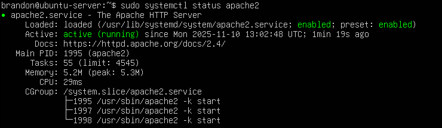
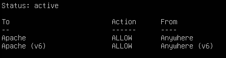
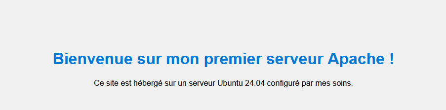
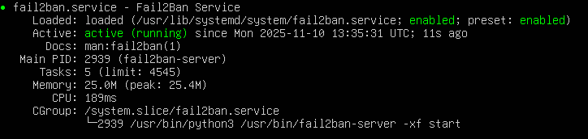

# 🌐 Projet 1 – Serveur Web Apache sous Linux

---

## 🧭 Introduction

Ce projet marque le début de mon parcours d’**administrateur système Linux**.  
L’objectif est d’installer, configurer et sécuriser un **serveur web Apache** permettant d’héberger un site web simple.  

Ce projet m’a permis de comprendre :
- Le fonctionnement d’un service réseau sous Linux.
- La gestion des permissions et des utilisateurs.
- Les bases de la sécurité système.
- Les principes du déploiement d’un site web statique.

---

## 🎯 Objectifs pédagogiques

- Installer un serveur web fonctionnel sous Ubuntu.  
- Gérer et configurer le service `apache2`.  
- Héberger et sécuriser un site web simple.  
- Comprendre la structure d’un répertoire web sous Linux.  
- Documenter les étapes pour assurer la reproductibilité.

---

## ⚙️ Environnement technique

| Élément | Détail |
|----------|--------|
| Système d’exploitation | Ubuntu Server 24.04 LTS |
| Nom d’hôte | `ubuntu-server` |
| Adresse IP | `192.168.1.100` |
| Service principal | Apache2 |
| Répertoire racine web | `/var/www/html` |
| Port utilisé | 80 (HTTP) |
| Pare-feu | UFW |
| Outil de sécurité | Fail2Ban |

---

## 🧱 Prérequis

- Disposer d'une VM sous Ubuntu server 24.04 fonctionnel.  
- Disposer des droits `sudo`.  
- Disposer d'un Accès réseau depuis la machine hôte.  
- Disposer d'une connexion Internet pour installer les paquets.

---

## 🔧 Étapes de mise en œuvre

### 1️⃣ Mise à jour du système
Avant toute installation, il faut s’assurer que le système est à jour :
```bash
sudo apt update && sudo apt upgrade -y
```
### 2️⃣ Installation du serveur Apache

On installe le paquet apache
```bash
sudo apt install apache2 -y
```

Vérification du statut du service
```bash
sudo systemctl status apache2
```

Résultat attendu
```bash
● apache2.service - The Apache HTTP Server
     Active: active (running)
```
Capture d'écran status d'Apache


Activation du service au démarrage
```bash
sudo systemctl enable apache2
```

### 3️⃣ Configuration du pare-feu
Si UFW est actif, il faut autoriser le trafic HTTP :
```bash
sudo ufw allow 'Apache'
sudo ufw enable
sudo ufw status
```

Sortie attendue :
```bash
Status: active
To                         Action      From
--                         ------      ----
Apache                     ALLOW       Anywhere
Apache (v6)                ALLOW       Anywhere (v6)
```

Capture d'écran UFW


### 4️⃣ Vérification de l’installation
Pour vérifier que tout fonctionne, on ouvre un navigateur puis on rentre l'adresse ip du serveur
```bash
http://192.168.1.100
```

### 5️⃣ Création d’un site personnalisé
Supprimer la page par défaut :
```bash
sudo rm /var/www/html/index.html
```

Créer une nouvelle page
```bash
sudo nano /var/www/html/index.html
```

Contenu d'exemple :
```html
<!DOCTYPE html>
<html>
<head>
    <meta charset="utf-8">
    <title>Mon premier serveur web</title>
    <style>
        body {
            background-color: #f0f0f0;
            font-family: Arial, sans-serif;
            text-align: center;
            margin-top: 100px;
        }
        h1 { color: #0078d7; }
    </style>
</head>
<body>
    <h1>Bienvenue sur mon premier serveur Apache !</h1>
    <p>Ce site est hébergé sur un serveur Ubuntu configuré par mes soins.</p>
</body>
</html>
```
On enregistre et on quitte

Vérification des permissions
```bash
sudo chown -R www-data:www-data /var/www/html
sudo chmod -R 755 /var/www/html
```
Ces commandes permettent d'assurrer que l'utilisateur *www-data* peut accéder au contenu

Vérification du bon fonctionnement de la nouvelle page web



### 7️⃣ Sécurisation du serveur
#### Installation de Fail2ban
Fail2ban protège contre les tentatives de connexion abusives : 
```bash
sudo apt install fail2ban -y
```

Vérification du statut de Fail2ban
```bash
sudo systemctl status fail2ban
```
Capture d'écran status de Fail2ban


### 🧩 Schéma d’architecture
```yaml
+---------------------------------------------------+
|                Serveur Ubuntu 22.04               |
|  IP : 192.168.1.100                               |
|                                                   |
|  ┌────────────────────────────────────────────┐   |
|  │ Service : Apache2                         │   |
|  │ Port : 80 (HTTP)                          │   |
|  │ Répertoire web : /var/www/html            │   |
|  │ Page : index.html                         │   |
|  └────────────────────────────────────────────┘   |
+---------------------------------------------------+
              │
              ▼
       Navigateur client (HTTP)
```

### 🧰 Commandes utiles
| Action                 | Commande                                                  |
| ---------------------- | --------------------------------------------------------- |
| Démarrer Apache        | `sudo systemctl start apache2`                            |
| Redémarrer Apache      | `sudo systemctl restart apache2`                          |
| Arrêter Apache         | `sudo systemctl stop apache2`                             |
| Voir les logs d’erreur | `sudo cat /var/log/apache2/error.log`                     |
| Voir les logs d’accès  | `sudo cat /var/log/apache2/access.log`                     |
| Sauvegarder le site    | `sudo tar -czvf /backup/html_backup.tar.gz /var/www/html` |

--- 
### 🧠 Compétences acquises
- Installation et configuration d’un service réseau.

- Gestion des services avec systemctl.

- Manipulation des fichiers et permissions Linux.

- Notions de base sur la sécurité (pare-feu, Fail2Ban).

- Compréhension de la structure d’un serveur web.

- Rédaction d’une documentation technique claire et structurée.

--- 
### 📂 Structure du dossier projet
```graphql
serveur-web-apache/
├── README.md               # Documentation du projet
├── index.html              # Fichier web hébergé
├── commandes.txt           # Liste des commandes utiles
├── captures/
│   ├── apache-status.png
│   ├── ufw-status.png
    └── fail2ban-status.png
│   └── page-site.png
```