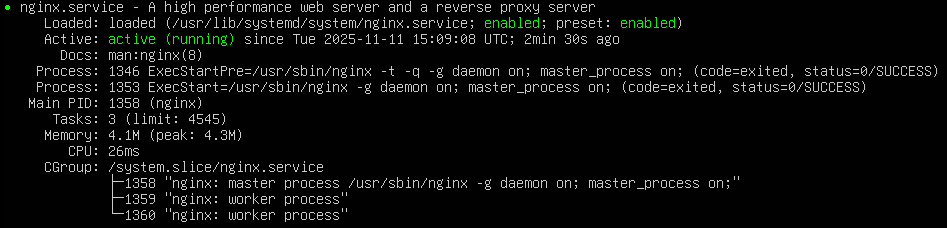
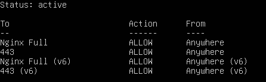
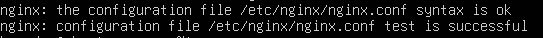

# 🌐 Projet 2 – Serveur Web Nginx + Reverse Proxy + HTTPS (Auto-signé)

---

## 🧭 Introduction

Ce projet s’inscrit dans la continuité de mon apprentissage en administration système Linux.  
L’objectif est de déployer un **serveur web Nginx**, plus léger et performant qu’Apache, afin d’héberger un site web, de mettre en place un **reverse proxy** et de sécuriser les connexions avec un **certificat SSL auto-signé**.

Ce projet permet de :
- Découvrir la structure de Nginx (`/etc/nginx/sites-available`),
- Comprendre le principe du **reverse proxy**,
- Gérer un certificat HTTPS localement,
- Sécuriser et documenter un service web complet.

---

## 🎯 Objectifs pédagogiques

- Installer et configurer Nginx.  
- Créer un site web statique accessible en HTTP et HTTPS.  
- Mettre en place un reverse proxy vers une application interne.  
- Configurer un certificat auto-signé pour les tests locaux.  
- Comprendre la logique d’accès interne/externe et la résolution locale.

---

## ⚙️ Environnement technique

| Élément | Détail |
|----------|--------|
| Système d’exploitation | Ubuntu Server 22.04 LTS |
| Nom d’hôte | ubuntu-server |
| Adresse IP locale | 192.168.1.110 |
| Service principal | Nginx |
| Répertoire web | `/var/www/mon-site` |
| Ports utilisés | 80 (HTTP), 443 (HTTPS) |
| DNS local | `monsite.local` |
| Certificat SSL | Auto-signé (OpenSSL) |

---

## 🧱 Prérequis

- Serveur Linux fonctionnel avec accès `sudo`.  
- Nginx installé et démarré.  
- Accès SSH ou console root.  
- Un fichier `/etc/hosts` configuré localement :


---

## 🔧 Étapes de mise en œuvre

### 1️⃣ Mise à jour du système
```bash
sudo apt update && sudo apt upgrade -y
```

### 2️⃣ Installation de Nginx
```bash
sudo apt install nginx -y
```

Vérification du service : 
```bash
sudo systemctl status nginx
```


Activation de Nginx lors du démerrage : 
```bash
sudo systemctl enable nginx
```

### 3️⃣ Configuration du pare-feu
Autoriser le trafic HTTP/HTTPS :

```bash
sudo ufw allow 'Nginx Full'
sudo ufw enable
sudo ufw status
```


### 4️⃣ Création du site web
```bash
sudo mkdir -p /var/www/mon-site
sudo chown -R www-data:www-data /var/www/mon-site
sudo chmod -R 755 /var/www/mon-site
```

Création d'une page HTML : 
```bash
sudo nano /var/www/mon-site/index.html
```

Contenu de la page :
```html
<!DOCTYPE html>
<html>
<head>
    <meta charset="utf-8">
    <title>Mon site Nginx</title>
</head>
<body>
    <h1>Bienvenue sur mon site Nginx</h1>
    <p>Ce site est hébergé localement avec HTTPS auto-signé.</p>
</body>
</html>
```

### 5️⃣ Création d’un certificat SSL auto-signé
```bash
sudo openssl req -x509 -nodes -days 365 -newkey rsa:2048 \
-keyout /etc/ssl/private/mon_site.key \
-out /etc/ssl/certs/mon_site.crt
```
📘 Description générale de la commande :

Cette commande utilise OpenSSL pour créer un certificat SSL/TLS auto-signé, qui permet de chiffrer les connexions HTTPS sur notre serveur sans passer par une autorité de certification externe (comme Let’s Encrypt).

🧩 Décomposition de chaque paramètre : 
| Option                                  | Explication                                                                                                                                                                          |
| --------------------------------------- | ------------------------------------------------------------------------------------------------------------------------------------------------------------------------------------ |
| `sudo`                                  | Exécute la commande avec les droits administrateur, car on écrit dans `/etc/ssl/`.                                                                                                   |
| `openssl`                               | Appelle l’outil de gestion cryptographique OpenSSL.                                                                                                                                  |
| `req`                                   | Indique qu’on veut générer une **requête de certificat** (CSR) ou un certificat lui-même.                                                                                            |
| `-x509`                                 | Spécifie qu’on veut créer un **certificat auto-signé** (et non juste une requête CSR).                                                                                               |
| `-nodes`                                | Signifie *“no DES”*, c’est-à-dire que **la clé privée ne sera pas protégée par un mot de passe** (utile pour un serveur, sinon Nginx devrait te le redemander à chaque redémarrage). |
| `-days 365`                             | Durée de validité du certificat en jours (ici, 1 an). Tu peux la modifier à 730 pour 2 ans par exemple.                                                                              |
| `-newkey rsa:2048`                      | Crée **une nouvelle paire de clés** RSA de 2048 bits (clé publique et clé privée).                                                                                                   |
| `-keyout /etc/ssl/private/mon_site.key` | Indique **où enregistrer la clé privée** du certificat. Cette clé doit rester secrète.                                                                                               |
| `-out /etc/ssl/certs/mon_site.crt`      | Permet d'indiquer **où enregistrer le certificat public** qui sera utilisé par Nginx.                                                                                                          |

### 6️⃣ Configuration du site dans Nginx
```bash
sudo nano /etc/nginx/sites-available/mon-site
``` 

Contenu de la configuration : 
```nginx
# HTTPS
server {
    listen 443 ssl;
    server_name monsite.local;

    ssl_certificate /etc/ssl/certs/mon_site.crt;
    ssl_certificate_key /etc/ssl/private/mon_site.key;

    root /var/www/mon-site;
    index index.html;

    location / {
        try_files $uri $uri/ =404;
    }
}

# Redirection HTTP vers HTTPS
server {
    listen 80;
    server_name monsite.local;
    return 301 https://$host$request_uri;
}
```

### 7️⃣ Activation du site et vérification
Création d'un lien symbolique vers le dossier *sites-enable/*
```bash
sudo ln -s /etc/nginx/sites-available/mon-site /etc/nginx/sites-enabled/
```

On test la configuration : 
```bash
sudo nginx -t
```


Il reste plus qu'a recharger Nginx avec la commande : 
```bash
sudo systemctl reload nginx
```

### 🔁 Configuration du Reverse Proxy
Si je souhaite accéder à mon application interne depuis l’extérieur, je peux mettre en place un reverse proxy sur mon serveur Nginx.
Le reverse proxy agit comme intermédiaire entre les utilisateurs externes et l’application hébergée sur le réseau local.

Par exemple, si mon application tourne en interne sur 192.168.1.110:8082, je peux créer un fichier de configuration Nginx dans le répertoire /etc/nginx/sites-available/ afin de rediriger le trafic entrant vers cette application.

Cela permet aux utilisateurs d’accéder à l’application via une adresse publique (ex : https://app.mondomaine.fr) sans exposer directement le port interne 8082 sur Internet.

```bash
sudo nano /etc/nginx/sites-available/proxy.conf
```

Et d'y mettre le contenu suivant :
```nginx
server {
    listen 80;
    server_name monerp.local;

    location / {
        proxy_pass http://192.168.1.100:8082;
        proxy_set_header Host $host;
        proxy_set_header X-Real-IP $remote_addr;
        proxy_set_header X-Forwarded-For $proxy_add_x_forwarded_for;
        proxy_set_header X-Forwarded-Proto $scheme;
    }
}
```

Il reste plus qu'a activer le site :
```bash
sudo ln -s /etc/nginx/sites-available/proxy.conf /etc/nginx/sites-enabled/
sudo nginx -t
sudo systemctl reload nginx
```

### 🧩 Schéma d’architecture
```lua
+---------------------------------------------------+
|                   Internet / LAN                  |
|   Utilisateur → https://monsite.local             |
+---------------------------------------------------+
             │
             ▼
+---------------------------------------------------+
|            Serveur Nginx (192.168.1.110)          |
|  Ports : 80 (HTTP) / 443 (HTTPS)                  |
|  - Certificat auto-signé                          |
|  - Reverse Proxy vers applications internes       |
+---------------------------------------------------+
             │
             ▼
+---------------------------------------------------+
|   Applications internes (ex: ERP, Wiki, API)      |
|   192.168.1.100:8082 / 192.168.1.101:8083 ...     |
+---------------------------------------------------+
```

### 🧰 Commandes utiles
| Action                  | Commande                                 |
| ----------------------- | ---------------------------------------- |
| Tester la configuration | `sudo nginx -t`                          |
| Redémarrer Nginx        | `sudo systemctl restart nginx`           |
| Recharger Nginx         | `sudo systemctl reload nginx`            |
| Voir les logs d’erreur  | `sudo tail -f /var/log/nginx/error.log`  |
| Voir les logs d’accès   | `sudo tail -f /var/log/nginx/access.log` |

### 🧠 Compétences acquises

- Administration et configuration de Nginx.

- Gestion des certificats SSL auto-signés.

- Redirection HTTP → HTTPS.

- Mise en place d’un reverse proxy.

- Gestion du DNS local et sécurité réseau.

- Débogage et analyse des logs Nginx.

### 📂 Structure du projet
```swift
projet-serveur-web-nginx/
├── README.md
├── index.html
├── commandes.txt
└── captures/
    ├── nginx-ufw-status.png
    ├── nginx-conf-status.png
    └── nginx-status.png
```

### 🧑‍💻 Auteur

Nom : Brandon GUYON
Rôle : Apprenti Auditeur Cybersécurité / Futur Administrateur Système Linux
Système principal : Windows + VMware Workstation
Date : Novembre 2025

💡 *Ce projet a été réalisé dans le cadre de ma formation personnelle en administration Linux. Il contribu à ma montée en compétences*